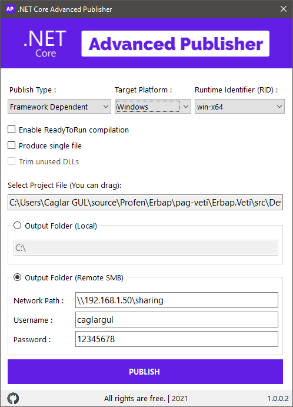

# .NET Core Advanced Publisher
- It was prepared using .NET Core CLI.
- Publish options, which are not available in Visual Studio, have been added.
- Available RIDs (Runtime Identifiers): 
  - Linux : `linux-x64` `linux-musl-x64` `linux-arm` `linux-arm` `linux-arm64` `rhel-x64`   `rhel.6-x64` `tizen` `tizen.4.0.0` `tizen.5.0.0`   
  - Windows :  `win-x64` `win-x86` `win-arm` `win-arm64` `win7-x64` `win7-x86` `win81-x64` `win81-x86` `win81-arm` `win10-x64` `win10-x86` `win10-arm` `win10-arm64`    
  - MacOS :`osx-x64` `osx.10.10-x64` `osx.10.11-x64` `osx.10.12-x64` `osx.10.13-x64` `osx.10.14-x64` `osx.10.15-x64` `osx.11.0-x64` `osx.11.0-arm64`

**Application Screenshot :**

